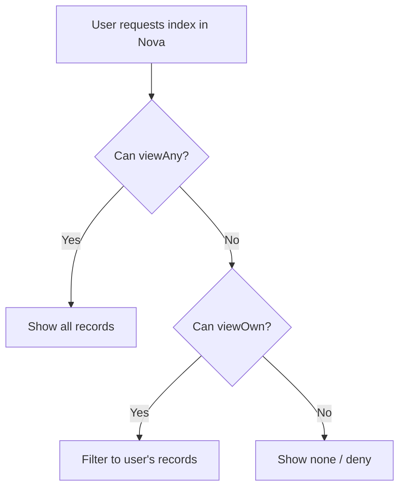

# Àyewòsàn Laboratory Management Application


A full-featured, robust, Laboratory Information Management System (LIMS) built with Laravel. It is designed to bridge the gap between clinical testing and patient recovery by automating the complex workflows of modern medical laboratories.It provides patient management, billing, lab test cataloging, lab results workflows, referral commission tracking, and payments handling for small-to-medium diagnostic laboratories.

## Àyewòsàn

Àyewòsàn is a made-up word from the Yoruba language. It is a blend of two Yoruba words Àyẹ̀wò (Examination) and Ìwòsàn (Healing). is a robust, Laboratory Information Management System (LIMS) built with Laravel. It is designed to bridge the gap between clinical testing and patient recovery by automating the complex workflows of modern medical laboratories.

## Key Features

- Patient management (create, edit, search, demographics)
- Billing system with multi-test bills, discounts, and deferred amount calculations
- Lab tests organized by category and group, with production cost and patient price
- Lab test results workflow (Pending → Recorded → Delivered)
- Referral system with commission calculation and referral transactions
- Payment transactions supporting multiple payment methods per bill
- Role-based access control (5 roles) with granular permissions (Spatie)
- Laravel Nova admin UI for data management

## Technical Stack

- PHP 8.x
- Laravel 9+
- Laravel Nova
- MySQL / MariaDB
- Composer
- Spatie Laravel-Permission

## High-level Repository Layout

- `app/` — application code (Models, Nova resources, Observers, Traits)
- `app/Nova/` — Nova resources (Patient, Bills, LabTests, LabTestsResults, PatientTransactions, ReferralTransactions, User, etc.)
- `database/migrations/` — migration files (27 total)
- `database/seeders/` — seeders (`RolesAndPermissionsSeeder`, `UsersSeeder`, `DemoDataSeeder`)
- `resources/` — static assets and views
- `routes/` — `web.php`, `api.php`

## Database Overview

Core tables (summary):

- `users`
- `patients`
- `bills`
- `bills_labtest` (pivot)
- `lab_tests`
- `lab_tests_categories`
- `lab_tests_groups`
- `lab_tests_results`
- `patient_transactions`
- `referral_transactions`
- Spatie permission tables (`roles`, `permissions`, `model_has_roles`, `role_has_permissions`, etc.)

For full column-level details and migration order, see `PROJECT_SCHEMA_MAP.md`.

## Getting Started (clone, install, run)

1. Clone the repository:

```bash
git clone https://github.com/<your-username>/labmanager.git
cd labmanager
```

2. Install PHP dependencies:

```bash
composer install
```

3. Environment setup:

```bash
cp .env.example .env
# Edit .env: DB_DATABASE, DB_USERNAME, DB_PASSWORD, MAIL_*, NOVA_ADMIN_EMAIL, NOVA_ADMIN_PASSWORD
php artisan key:generate
```

4. Run migrations and seed core data:

```bash
php artisan migrate
php artisan db:seed --class=RolesAndPermissionsSeeder
php artisan db:seed --class=UsersSeeder
php artisan db:seed --class=DemoDataSeeder
```

Notes:

- `DemoDataSeeder` creates demo referrers, patients, bills (amounts left at 0 until you use the "Update Bill Amounts" action), transactions, and results.
- `DatabaseSeeder` orchestrates core seeders — run `php artisan db:seed` to seed everything configured.

5. Serve locally:

```bash
php artisan serve
# Nova admin UI: http://127.0.0.1:8000/admin
```

## Environment Variables (important)

- `APP_NAME`, `APP_ENV`, `APP_DEBUG`, `APP_URL`
- `DB_CONNECTION`, `DB_HOST`, `DB_PORT`, `DB_DATABASE`, `DB_USERNAME`, `DB_PASSWORD`
- `MAIL_*` for email notifications
- `NOVA_ADMIN_EMAIL`, `NOVA_ADMIN_PASSWORD` (convenience for seeders)

## Roles & Permissions

- Predefined roles: `super-admin`, `Receptionist`, `Accountant`, `Laboratory Technician`, `Non-technical Admin`.
- Permissions are generated per model (viewAny, view, create, update, delete, destroy, viewOwn).
- `super-admin` is assigned all permissions by default.

## Nova-specific notes

- Fields explicitly map to database attributes (e.g., `Date::make('Birth Date', 'birth_date')`) to avoid null-binding issues.
- Use `Number::make(...)->step(0.01)` for monetary/decimal fields to avoid NumberFormatter/polyfill errors.
- Index filtering checks `viewAny` before `viewOwn` to ensure accurate data visibility across roles.

## Seeders & Observers

- Seeders:
    - `RolesAndPermissionsSeeder` — creates roles and permissions
    - `UsersSeeder` — creates staff users and role assignments
    - `DemoDataSeeder` — populates demo referrers, patients, bills, payments, lab results, referral transactions

- Observers:
    - Bills observer handles processed_by, and amount calculations (triggered via Nova action)
    - Transactions observers update balances and related entities

## Running Tests

Run PHPUnit tests (if available):

```bash
./vendor/bin/phpunit
```

## Troubleshooting

- If seeded data doesn't appear in Nova, clear caches:

```bash
php artisan cache:clear
php artisan config:clear
php artisan route:clear
php artisan view:clear
```

- If you see NumberFormatter polyfill errors, ensure Nova uses `Number::make` instead of `Currency::make`.
- If patient creation throws `Column 'birth_date' cannot be null`, check Nova field attribute mapping for `birth_date`.

## Contributing

1. Fork repository
2. Create branch `feat/your-feature`
3. Implement changes and tests
4. Open a PR describing the change

I can add `CONTRIBUTING.md` or CI workflow files on request.

## Make repository public (quick)

```bash
git remote add origin git@github.com:<your-username>/labmanager.git
git branch -M main
git push -u origin main
```

## License

This project is licensed under the **MIT License** — see the [LICENSE](LICENSE) file for full details.

### Summary

This code is **free to use, modify, and distribute** by anyone with no restrictions. You can:

- ✅ Use this code commercially or privately
- ✅ Modify and adapt the code for your needs
- ✅ Distribute copies and modifications
- ✅ Include it in your own projects

### Important Disclaimer

**NO WARRANTY OR LIABILITY**: The software is provided "as-is" without any warranty of any kind. The authors assume no responsibility for damages, failures, data loss, or any other issues that may arise from using this code. Use at your own risk.

### Third-Party Dependencies

This project includes **Laravel Nova**, which is a commercial product owned by Laravel.

- **Nova License**: Laravel Nova is **not included** in this MIT-licensed code and must be separately licensed from [laravel.com](https://nova.laravel.com).
- **Nova Restrictions**: If you deploy or use this application, you are responsible for obtaining your own Nova license. The MIT license of this project does **not grant you rights** to Laravel Nova.
- **Open Source Components**: All other dependencies (Laravel, Spatie Laravel-Permission, etc.) are included under their respective licenses. See `composer.json` for the complete list. As such Laravel Nova's files are not included in this repository.

### Installing Laravel Nova

After purchasing a license and getting Laravel Nova files, Follow the instructions below to install the package locally;

1.  Unzip the Nova files and copy them to `./vendor/nova`
2.  Add the custom repository to your `./composer.json` by adding the following code:

        ```json
        "repositories": [
            {
                "type": "path",
                "url": "./vendor/nova"
            }
        ]
        ```

3.  Then run `composer require laravel/nova` to complete the installation.

### Attribution

If you use or fork this project, attribution is appreciated but not required.

---

See `PROJECT_SCHEMA_MAP.md` and `CHECKPOINT.md` for schema and current project state.

## Workflows & User Journey

This section explains common user journeys and the internal logic flows used across the application. Diagrams are provided in Mermaid syntax (supported by many Markdown renderers including GitHub with Mermaid enabled).

### 1) Patient → Bill → Payment → Result (Main happy path)

User journey summary:

- Receptionist creates a `Patient` record.
- Receptionist or Lab technician creates a `Bill` and attaches one or more `LabTests`.
- Accountant or Receptionist records `PatientTransactions` (payments). Multiple payments can be applied to a single bill.
- Laboratory Technician records `LabTestsResults` per bill/test, marking status as Pending → Recorded → Delivered.

Mermaid flow:

```mermaid
flowchart TD
    A[Receptionist creates Patient] --> B[Create Bill]
    B --> C{Attach Lab Tests}
    C --> D[Save Bill (amounts = 0 until Update)]
    D --> E[Record Payments]
    E --> F[Update Bill Amounts (Nova action)]
    D --> G[Lab Technician records Results]
    G --> H[Result status -> Delivered]
```

Notes on logic:

- Bills are created with amounts set to 0 by seeders and creation flows; amount calculation is gated behind a Nova action "Update Bill Amounts" to preserve manual control.
- Observers (BillsObserver, PatientTransactionsObserver) update related fields such as `processed_by` or account balances. Observers avoid forcing amount recalculation unless the Nova action is triggered.

### 2) Referral Commission Flow

User journey summary:

- When a `Patient` has a `referrer` (a `User` with referrer role), the `Bill` records the referral.
- After payments are recorded and/or services are delivered, the system calculates referral commission (per-bill commission rate) and records `ReferralTransactions` (credit earnings, later debit payouts).

Mermaid flow:

```mermaid
flowchart LR
    P[Patient with Referrer] --> B[Bill created]
    B -->|Payments recorded| T[Trigger commission calc]
    T --> R[Create Referral Transaction (credit)]
    R --> S[Referrer account balance updated]
    S -->|Payout requested| O[Referral Transaction (debit) recorded]
```

Notes on logic:

- Referral transactions are recorded separately and linked to a referrer and the originating bill.
- Observers ensure that creating a referral credit updates the referrer's running account balance.

### 3) Permission / Data Visibility Flow

User journey summary:

- System uses Spatie permissions with per-model abilities (`viewAnyModel`, `viewOwnModel` etc.).
- Nova resources implement `indexQuery()` to restrict list views to owned records for users who have `viewOwn` but not `viewAny` privileges.

Mermaid flow:



Notes on logic:

- This check prevents accidental hiding of data from super-admins and ensures users without global view access only see their own records.
- The shared `IndexQueryTrait` centralizes this behavior for resources that filter by a `user` foreign key.

## Architecture & Data Flow Explanation

- Models and relationships: standard Eloquent relations (BelongsTo, HasMany, BelongsToMany). Example: `Bill` belongs to a `Patient`, and `Bill` has many `LabTests` through a pivot.
- Observers: `BillsObserver` sets `processed_by` and orchestrates amount calculation only when the Nova action is triggered; `PatientTransactionsObserver` updates bill payment totals and triggers referral calculations when appropriate.
- Seeders: `DemoDataSeeder` creates sample data but intentionally avoids invoking amount calculations to preserve the manual update workflow.
- Nova resources: fields map explicitly to database attributes to prevent null-binding errors (e.g., `Date::make('Birth Date', 'birth_date')`). Monetary fields use `Number::make(...)->step(0.01)` due to polyfill limitations with `NumberFormatter`.

## Example: Bill amount calculation (high level)

1. User clicks "Update Bill Amounts" action in Nova for a bill.
2. The action recalculates totals from attached `LabTests` (patient_price), applies discounts, computes tax if any, updates `bills.total`, `bills.subtotal`, and `bills.discount`.
3. Observers then evaluate referral commission eligibility and create `ReferralTransactions` if applicable.

## Diagrams & Assets

- The Mermaid diagrams above provide quick visualizations. If you want PNG/SVG exports, I can generate image assets and add them to `docs/` or `resources/docs/` for inclusion in the repo.

## Next steps I can take (optional)

- Generate PNG/SVG images from Mermaid diagrams and commit to `docs/`.
- Create `CONTRIBUTING.md` and `CODE_OF_CONDUCT.md`.
- Add a minimal GitHub Actions workflow for PHP unit tests and static analysis.

---

If you'd like, I can now generate diagram images and add them to `docs/`, or create `CONTRIBUTING.md` next. Which would you prefer?
